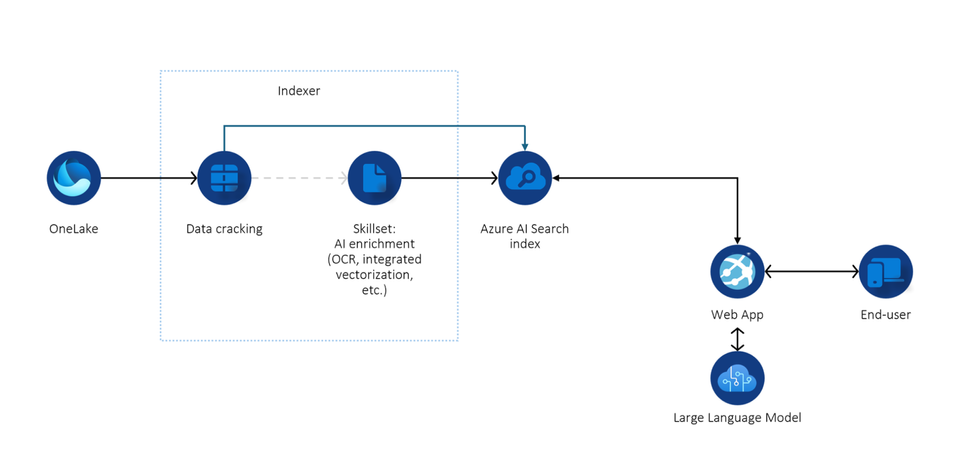

ChainLit based RAG Application using Azure AI Search with OneLake Lakehouse
=====================================================

This project demonstrates how to build a chat application using ChainLit that retrieves documents from a semantically enabled hybrid AI Search and feeds them into an llm like GPT-4o for insightful responses.

Prerequisites
-------------

-   Python 3.x installed on your machine.
-   Azure AI Search instance.
-   Azure Fabric workspace with OneLake Lakehouse.

Setup Instructions
------------------

### 1\. Create and Activate a Virtual Environment

First, create a virtual environment using the following command:

`python -m venv venv`

Activate the virtual environment:

-   On Windows:

    `venv\Scripts\activate`

-   On macOS/Linux:

    `source venv/bin/activate`

### 2\. Install Dependencies

Install the required dependencies from the `requirements.txt` file:

`python -m pip install -r requirements.txt`

### 3\. Configure Keys and Endpoints in code

Fill out the necessary variables and credentials in the `app.py` file. This includes the configuration settings for your Azure AI Search and other required services like Azure OpenAI.

### 4\. Enable System Managed Identity and Assign Roles

-   **Enable System Managed Identity:** In your Azure AI Search instance, enable the system-managed identity.
-   **Assign Contributor Role:** Assign a contributor role to this identity in your Fabric workspace where your Lakehouse resides.

### 5\. Import and Vectorize Data

In your Azure AI Search instance:

-   Click on **Import and Vectorize Data**.
-   Select **Lakehouse** as your data source and checkmark the other necessary options in the wizard.
-   Azure will automatically create an index, a data source, and an indexer. Schedule the indexer to detect new data in your Lakehouse based on your preferred time interval.

### 6\. Run the Application

After completing the above steps, you can run the chat application with the following command:

`chainlit run app.py`